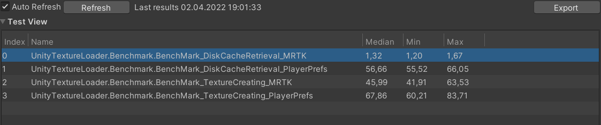

# Async Load Texture

There are many custom solutions which require additional plugins and testing. 

This is the straight forward solution, by cleverly using Unity tools and UniTask.

Load texture for images completly asynchronyously, using Persistant Path cache or SD Card cache.

Options to extend and use custom cache, as well as add custom regex to remove tokens/expiration/accesskey and other temporal data from your urls.

# Dependency
1) UniTask - see https://github.com/Cysharp/UniTask
2) MRTK (Mixed Reality Toolkit by Microsoft) - see https://github.com/microsoft/MixedRealityToolkit-Unity

# Usage

See example : [Example](./Runtime/Example/SampleLoadFromUrlsOrStorage.cs)

1) Create instance of DiskCache (custom or one of the provided).
2) Create instance of LoadTextureAsync
3) Add DiskCache to LoadTextureAsync
4) Use LoadTexture(errorTexture, url) or LoadTexture(errorTexture, url, headers, cancelationToken)

# Important

Be sure to check out if the target platform supports given cache folder : https://docs.unity3d.com/ScriptReference/Application-persistentDataPath.html

# Benchmark:
Loading 50 1.9 Mb image (1600*1000) :
1) Loading Raw Bytes from Disk Cache
2) Loading Full texture

